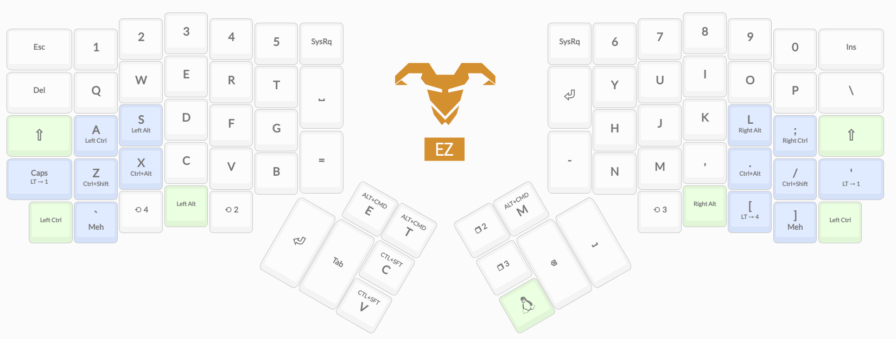

# My Ergodox 
After using the Ergodox EZ for about a month, I've gotten comfortable with it and have settled down (mostly) on my layout.

My layout comprises of 5 layers and it's aimed at reducing finger movement by moving hot keys to the home row. I'm using the QWERTY layout (don't scream at me).

## Home 

This is the home layer, where my normal keyboard is found. Right off the bat, you'll notice that the `shift`, `ctrl` and `alt` keys are set within the home row. I've noticed that this makes it a lot easier to access the keys are reduce finger travel.

I added dual function keys for the `ctrl + shift` and `ctrl + alt` keys so that I can access common shortcuts in my editor easily. I used to have a layer for my shortcuts for applications like Intellij but I noticed that having to memorise where the keys are and having to constantly modify the layout when I need to add another shortcut was too tedious.

My thumb clusters are inverted since when on a normal keyboard, I hit the space key with my right hand instead of my left.

I also moved the `esc` and `insert` keys to the top as they are used less often, and I bumped the `=` and `-` keys to clusters near the index finger to easily reach since they're used more often.

I added some common shortcuts for launching apps since I've set them in my OS (Manjaro + KDE). `alt + cmd + e` launches the file explorer, `alt + cmd + t` launches the terminal, `alt + cmd + m` launches the system log.

## Symbols

I can access my symbols layer with a long press on the `caps` and `'` key which are located right below the `shift`s where they were originally meant to be.

My symbols layer is a slight modification from the original layer. 

The minor changes made are like moving `!` to be reached by the index finger and replacing its original position with `|` since it is less used.

## Mouse

My mouse layer can be accessed by long pressing the button near the left thumb cluster with my thumb. 

The typical mouse movement keys are on the right side of the board since it's more intuitive to do so. 

On the left are the mouse commands like button clicking and scrolling. 

I do not use this layer often but it does come in handy at times.

## Navigation

My navigation layer can be accessed by long pressing the button near the right thumb cluster with my thumb.

The layer is built for navigating text chunks and it has the core necessities like the whole suite of modifiers at home row and other keys like `home` and `end` near the home row for easy access.

## Controls

My final layer is the controls layer for things like volume and brightness. I added some keys to the thumb clusters for controlling the board's LED settings too.

On the right side is primarily for audio and brightness.

The left side is customised to work with KDE's desktop system, where I can easily switch between the desktops within reach of home row.